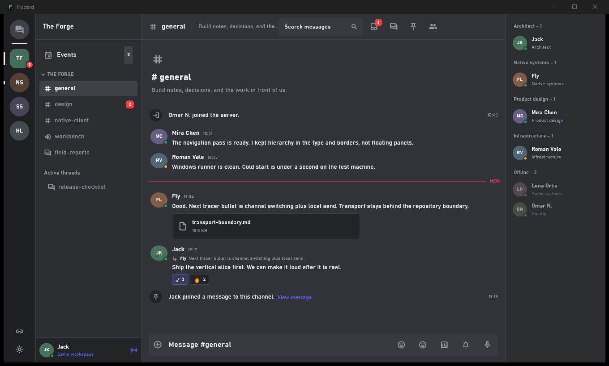
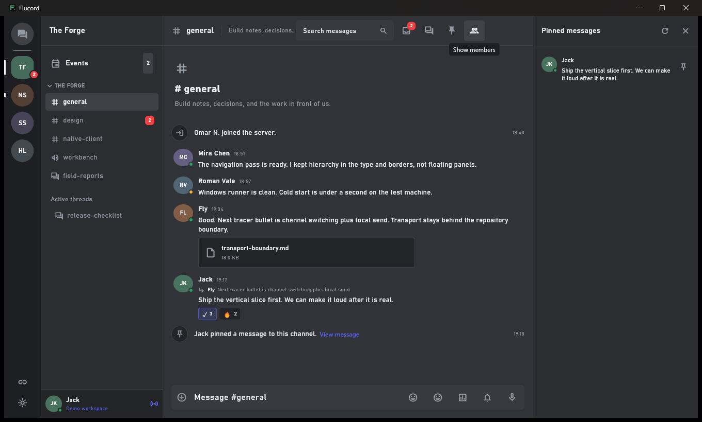

# Flucord

Flucord is a [Redstone](https://redstone.md) project originally created by
**Rxflex**. It is an experimental native Discord desktop client built with
Flutter. It replaces the Electron shell with Flutter widgets, native Windows
networking, SQLite caching, platform integrations, and packaged media
libraries. It does not embed Discord's interface in a browser. QR login uses
one short-lived system WebView2 surface only when Discord requires hCaptcha.

> [!IMPORTANT]
> Flucord is not affiliated with Discord. The desktop-user transport relies on
> Discord's private client protocol, which can change without notice. Matching
> the official desktop profile does not guarantee protocol stability or account
> enforcement outcomes.



## Status

Windows is the primary verified target. macOS and Linux runners exist, but need
native-host release validation. The current desktop-user tracer bullet includes
native QR remote auth, vault-backed session restoration, Gateway workspace
hydration, channel history, and message operations.

The QR and main Gateway WebSocket handshakes are live-validated, including the
mandatory hCaptcha response contract. A completed CAPTCHA solve, desktop-user
session restore, Gateway `READY`/`GUILD_CREATE`, guild/channel hydration, and
live channel history are verified against a test account on Windows.

| Area | Status |
| --- | --- |
| Flutter desktop shell | Ready |
| Native QR login | Ready; QR approval and mandatory hCaptcha live-validated |
| Saved account session | Ready; operating-system credential vault |
| Servers, channels, DMs | Implemented through Gateway bootstrap |
| Message history and mutations | Implemented through desktop REST |
| Live message events | Implemented through desktop Gateway |
| Threads, members, presence | Partial |
| Voice, video, screen share for user chat | Not ready |
| ETF/zstd Gateway framing | Not ready; JSON v9 currently used |

See [the full feature parity table](docs/FEATURE_PARITY.md) for exact boundaries.

## Screenshots

The screenshots use the deterministic local demo repository. No Discord account
or copied client data is involved.

| Workspace | Pinned messages |
| --- | --- |
|  |  |

## Highlights

- Native server rail, channel tree, message timeline, member list, search, and
  responsive compact layouts.
- Replies, reactions, pins, threads, forums, polls, stickers, attachments,
  forwarding, editing, deletion, and unread boundaries.
- Native notifications, tray lifecycle, deep links, secure credential storage,
  SQLite cache, downloads, media playback, and voice-device surfaces.
- Separate transport adapters for desktop-user chat, OAuth, Bot development,
  and the optional Discord Social SDK.
- No Electron, bundled Chromium runtime, browser session extraction, copied
  cookies, or imported Discord local storage. The hCaptcha WebView2 is
  ephemeral and cleared immediately after completion.

## Quick Start

### Requirements

- Flutter 3.44 or newer with Windows desktop support.
- Dart 3.12 or newer.
- Visual Studio 2022 with the Desktop development with C++ workload.
- Windows 10 or 11 for the currently verified build.
- Microsoft Edge WebView2 Runtime for Discord's hCaptcha challenge.

### Run the client

```powershell
flutter pub get
flutter run -d windows
```

Open **Connections**, select **Sign in with QR code**, scan the QR code in the
Discord mobile app, and approve the desktop login. Flucord stores the resulting
session only in the operating-system credential vault.

### Run with mock data

```powershell
flutter run -d windows --dart-define=FLUCORD_DEMO_MODE=true
```

Demo mode is compile-time and never restores a real account session.

### Build a Windows release

```powershell
flutter build windows --release
```

Distribute the complete directory below, not only `flucord.exe`:

```text
build/windows/x64/runner/Release/
```

### Published releases

Windows x64 releases are published from semantic version tags such as
`v0.0.1`. Each release contains the complete runtime directory as a ZIP and a
`SHA256SUMS.txt` file. Verify the archive before extracting it:

```powershell
Get-FileHash -Algorithm SHA256 .\flucord-windows-x64-v0.0.1.zip
Get-Content .\SHA256SUMS.txt
```

Maintainers publish a release by updating the `pubspec.yaml` version, creating
an annotated matching tag, and pushing it. GitHub Actions audits the complete
repository history, analyzes and tests the project, builds Windows, generates
detailed notes from GitHub and Git history, and publishes the assets.

## Architecture

```text
Flutter presentation
  -> application controllers
    -> ChatRepository / gateway interfaces
      -> desktop-user, OAuth, Bot, or demo adapters
        -> WinHTTP WebSocket / REST / SQLite / OS vault / native media
```

Server state stays behind repository and gateway contracts. Controllers own
workflow state, widgets render immutable domain models, and transport secrets
do not enter presentation objects or logs. Windows WebSockets use WinHTTP via
Dart FFI because Discord's Cloudflare edge rejects the equivalent `dart:io`
TLS handshake before protocol negotiation.

Key entry points:

- `lib/src/domain/`: immutable models and transport-neutral contracts.
- `lib/src/data/discord/`: Discord REST, Gateway, remote-auth, and mapping code.
- `lib/src/application/`: connection, workspace, login, and media controllers.
- `lib/src/presentation/`: the native Flutter desktop interface.
- `windows/runner/`: Windows runner and optional native SDK bridges.

## Verification

```powershell
.\tool\audit_public_repository.ps1
flutter analyze
flutter test
flutter build windows --release
```

The privacy audit examines every reachable commit, its metadata and historical
paths, tracked text, and image metadata. It blocks known credential formats,
private keys, personal email addresses, public IP addresses, local user paths,
and non-fixture Discord snowflakes without printing matched secret values.

Live network checks are opt-in:

```powershell
$env:FLUCORD_LIVE_REMOTE_AUTH_TEST='1'
flutter test test/discord_remote_auth_live_test.dart

$env:FLUCORD_LIVE_GATEWAY_TEST='1'
flutter test test/discord_desktop_gateway_live_test.dart
```

The current Windows checkout passes analysis, more than 500 automated tests,
both live WebSocket checks, completed QR/hCaptcha account login, native
workspace hydration, and a release build. Automated live tests validate
transport and QR creation; the completed phone approval and hCaptcha flow was
validated interactively because those steps require a person.

## Documentation

- [Feature parity](docs/FEATURE_PARITY.md)
- [Desktop protocol notes](docs/DISCORD_DESKTOP_PROTOCOL.md)
- [Session and transport boundaries](docs/SESSION_TRANSPORT.md)
- [Desktop integration](docs/DESKTOP_INTEGRATION.md)
- [Native media](docs/NATIVE_MEDIA.md)
- [Roadmap](roadmap.md)

## Contributing

Use `roadmap.md` as the source of truth for the next vertical slice. Keep
desktop-user, OAuth, Bot, Social SDK, and demo transports independent; add tests
at the repository/controller boundary; and keep Dart/C++ source files below 500
lines.

## License

Flucord is source-available under the [Flucord Project License 1.0](LICENSE).
The license permits personal and commercial use, modification, forks, and
distribution of Flucord while requiring attribution, published corresponding
source, and the same license for derivatives.

The canonical project is maintained in the
[redstone-md GitHub organization](https://github.com/redstone-md).

The interface may be changed inside Flucord or a compliant fork, but it may not
be extracted, ported, or reused in a separate product, UI library, template,
theme, or design system. Every distribution must preserve the [NOTICE](NOTICE),
credit original author **Rxflex**, preserve the Redstone project identity, and
link to this canonical repository.

Because of the project-integrity restriction, this is not an OSI-approved Open
Source license. Separately identified third-party components retain their own
licenses.
